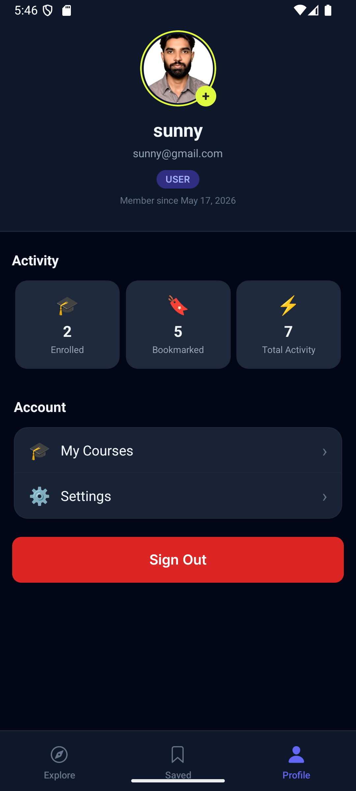

# LearnHub LMS

A production-grade Mini LMS mobile application built with React Native Expo and TypeScript.

[Watch Demo Video (Placeholder)]() | [Download APK (Placeholder)]()

## Screenshots

| Explore / Home | Course Details | Lesson View (WebView) | Profile / Settings |
|:---:|:---:|:---:|:---:|
|  |  |  |  |

## Features

**Core Learning Experience**
- **Robust WebView**: Interactive lesson environment using `react-native-webview` with error handling, fallback states, and bridge communication (`postMessage`).
- **Progress Tracking**: Tracks completed lessons and chapters, visually representing progress via dynamic progress bars and lesson checklists.
- **Bookmarks & Enrollments**: Save courses for later or enroll to start tracking progress.

**User & Authentication**
- **Auto-Login**: Seamless session restoration on app restart via token validation flow.
- **Profile Management**: Update profile picture natively utilizing `expo-image-picker`.
- **Offline Resilience**: Local caching of progress and settings to ensure smooth UX even on flaky networks.

**Navigation & Discovery**
- **Search & Filter**: Real-time course list filtering with debounced search functionality.
- **Local Notifications**: Implements milestone notifications based on bookmark thresholds and includes a 24-hour inactivity reminder mechanism.

## Tech Stack

- **Framework**: `react-native` (0.81.5), `expo` (~54.0.33)
- **Navigation**: `expo-router`
- **State Management**: `zustand` (Global), `@tanstack/react-query` (Server State)
- **Styling**: `tailwindcss`, `nativewind`
- **Storage**: `@react-native-async-storage/async-storage`, `expo-secure-store`
- **Media & Components**: `expo-image`, `expo-image-picker`, `react-native-webview`, `expo-notifications`
- **Validation**: `zod`
- **Networking**: `axios`, `@react-native-community/netinfo`, `expo-network`

## Project Structure

```text
C:\USERS\SUNNY\DESKTOP\LMS
|
+---app
|   |   index.tsx
|   |   _layout.tsx
|   +---(auth)
|   |       login.tsx
|   |       register.tsx
|   |       _layout.tsx
|   +---(tabs)
|   |       bookmarks.tsx
|   |       home.tsx
|   |       profile.tsx
|   |       settings.tsx
|   |       _layout.tsx
|   \---course
|           webview.tsx
|           [id].tsx
|
\---src
    +---assets
    |   \---webview
    |           course-template.html
    +---components
    |   +---common
    |   |       ErrorBoundary.tsx
    |   |       OfflineBanner.tsx
    |   |       RetryView.tsx
    |   |       ScreenWrapper.tsx
    |   +---course
    |   |       CourseCard.tsx
    |   |       CourseCardSkeleton.tsx
    |   |       CourseList.tsx
    |   +---ui
    |   |       Avatar.tsx
    |   |       Badge.tsx
    |   |       Button.tsx
    |   |       Card.tsx
    |   |       EmptyState.tsx
    |   |       Input.tsx
    |   |       Skeleton.tsx
    |   \---webview
    |           CourseWebView.tsx
    +---constants
    |       api.constants.ts
    |       app.constants.ts
    +---features
    |   +---auth
    |   |   +---hooks
    |   |   |       useLogin.ts
    |   |   |       useLogout.ts
    |   |   |       useRegister.ts
    |   |   |       useSession.ts
    |   |   \---schemas
    |   |           auth.schema.ts
    |   \---courses
    |       +---hooks
    |       |       useCourses.ts
    |       |       useSearchCourses.ts
    |       \---utils
    |               courseTransform.ts
    +---hooks
    |       useAppState.ts
    |       useDebounce.ts
    |       useNetworkStatus.ts
    +---lib
    |       queryClient.ts
    |       storage.adapters.ts
    |       userScopedStorage.ts
    +---providers
    |       NetworkProvider.tsx
    |       NotificationProvider.tsx
    |       QueryProvider.tsx
    +---services
    |   +---api
    |   |       auth.api.ts
    |   |       client.ts
    |   |       courses.api.ts
    |   |       instructors.api.ts
    |   +---notifications
    |   |       notification.service.ts
    |   \---storage
    |           async.storage.ts
    |           secure.storage.ts
    +---stores
    |       auth.store.ts
    |       bookmark.store.ts
    |       enrollment.store.ts
    |       offline.store.ts
    |       preferences.store.ts
    |       progress.store.ts
    |       userStoreManager.ts
    +---theme
    |       colors.ts
    +---types
    |       api.types.ts
    |       domain.types.ts
    |       navigation.types.ts
    \---utils
            date.utils.ts
            error.utils.ts
```

## Setup Instructions

1.  **Install dependencies:**
    Due to NativeWind peer dependencies, install with legacy flags:
    ```bash
    npm install --legacy-peer-deps
    ```

2.  **Start the development server:**
    Clear the cache to prevent stale Metro bundler issues:
    ```bash
    npx expo start --clear
    ```

3.  **Run on a device or emulator:**
    Press `a` for Android, or `i` for iOS in the Expo CLI.

## Build Instructions (Android APK)

This project is configured via `eas.json` to output a standalone Android `.apk` file using the `preview` profile.

1.  Install EAS CLI globally: `npm install -g eas-cli`
2.  Login to your Expo account: `eas login`
3.  Trigger the build: 
    ```bash
    eas build -p android --profile preview
    ```

## API

The application utilizes a mock backend for authentication and data generation.

**Base URL**: `https://api.freeapi.app/api/v1`

**Endpoints**:
- **Auth**: `/users/register`, `/users/login`, `/users/logout`, `/users/current-user`, `/users/refresh-token`
- **Public Data**: `/public/randomusers` (Instructors), `/public/randomproducts` (Courses)

## Environment Variables

This project is designed for immediate evaluation and **does not require** any `.env` files or environment variables to be configured. All necessary configuration, including the base API URL, is safely contained within `src/constants/api.constants.ts`.

## Key Architectural Decisions

- **Feature-Based Structure**: Code is partitioned logically into `features/`, `stores/`, `components/`, and `services/` to enforce domain separation and scalability.
- **Zustand + Persistence Layer**: Global state (Progress, Bookmarks, Enrollments) is managed by Zustand and isolated per-user via a custom `userScopedStorage` adapter backed by `AsyncStorage`. Auth state is securely persisted using `expo-secure-store`.
- **Data Transformation Layer**: Responses from the `freeapi.app/randomproducts` endpoint are structurally mapped into LMS domain entities (courses, chapters, lessons) in `courseTransform.ts` utilizing deterministic seeding.
- **WebView Bridge**: Interactive course materials are sandboxed in `CourseWebView.tsx`, utilizing `postMessage` to communicate securely with the React Native layer.

## Known Issues & Limitations

- **Backend Synchronization**: Because the app relies on a public placeholder API (`freeapi.app`), there is no real backend to store user progress or enrollments. All state is persisted locally on the device using `AsyncStorage`. If a user uninstalls the app or switches devices, their progress will not sync.
- **Simulated Video Content**: The course lessons do not stream actual video content. The WebView integration simulates lesson completion via a structured HTML template rather than an actual video player.
- **API Image Stability**: The original dummy API provides stale image CDN URLs that frequently return `404`. As a workaround, the transformation layer seamlessly falls back to seeded `picsum.photos` placeholders to ensure images render correctly without breaking the UI.
- **Orientation**: The application design is currently locked to `portrait` mode (via `app.json`) and does not dynamically support landscape interfaces.
